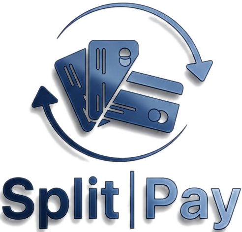
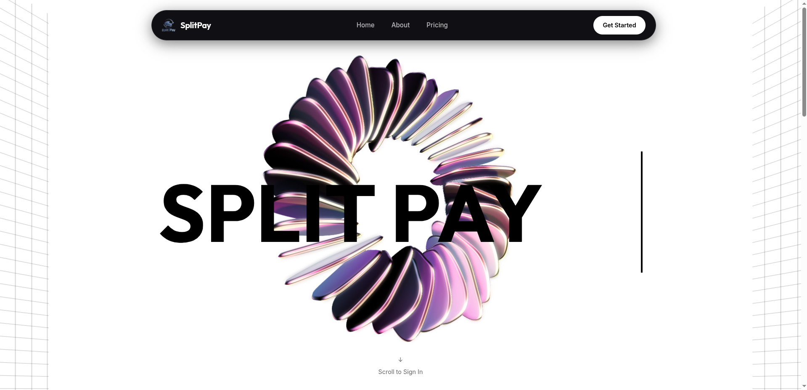
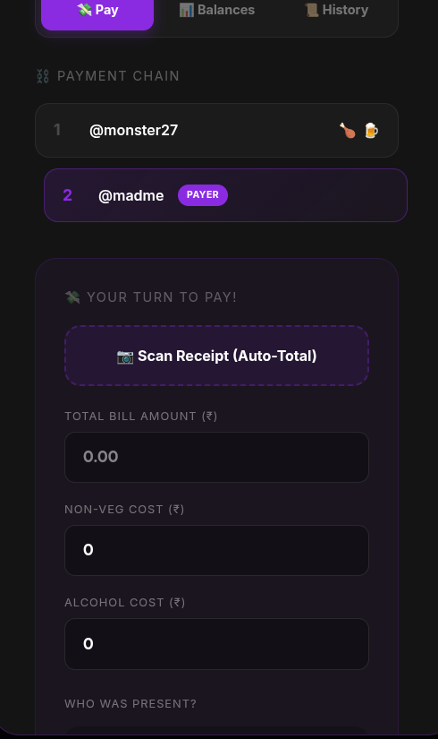
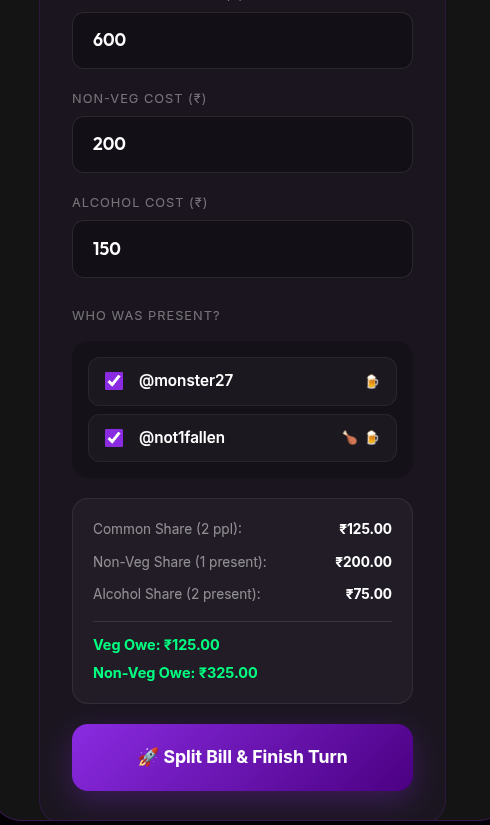
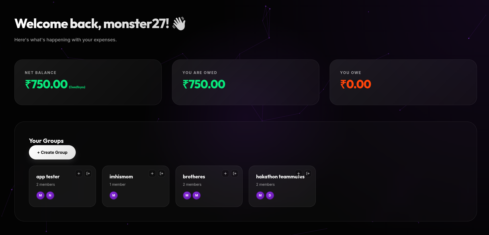
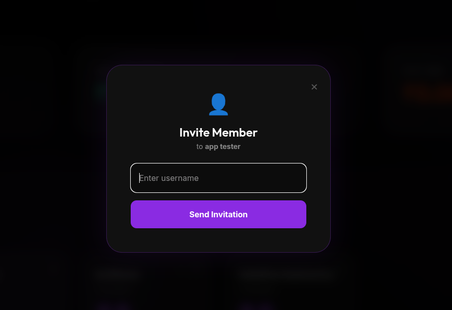
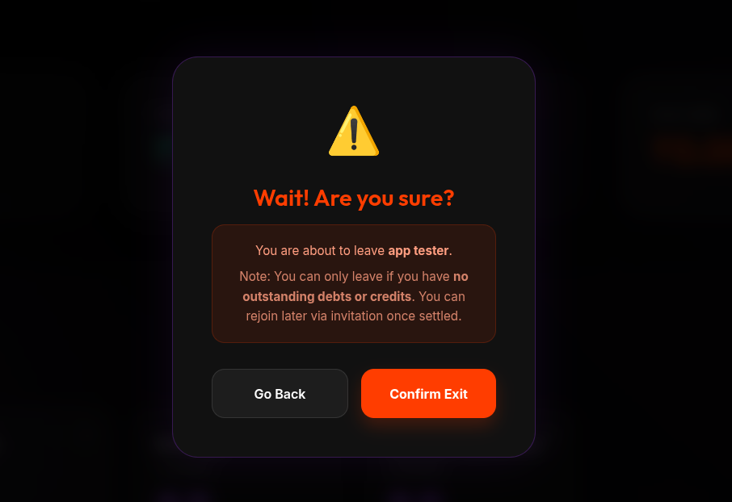

  

# SPLIT-PAY — Manage Expenses, Minus the Stress

  

SplitPay is a smart bill-splitting application designed specifically for Indian friend groups who value fairness and simplicity. Unlike traditional expense trackers that only track debts, SplitPay ensures everyone pays their fair share over time through an intelligent turn-based payment system. The app solves common frustrations like some friends always paying while others never do, veg friends subsidizing non-veg items, and non-drinkers paying for alcohol. With features like automatic dietary preference splitting, democratic group voting, a lifeline system for flexibility, trust scores for accountability, and a red card system for consistent defaulters, SplitPay makes bill-splitting effortless and fair. Built with Next.js, Django, and PostgreSQL, it offers real-time updates through WebSocket integration, ensuring all group members stay synchronized. SplitPay is open source and designed with Indian dining culture in mind, where fairness matters but friendship matters more.

---

## Getting Started

To get started, scroll down on the homepage to log in with Google. After that, choose an account or enter your email and password, then click **Continue**.

If you already have an account, you will simply enter your username and proceed, as your username is linked to your email at sign-up. If you don't have an account yet, you can sign up and create a username that isn't already taken. You will also choose your preferences — veg or non-veg, and drinker or non-drinker — for better results.

You will then be redirected to the dashboard, which is the main interface of the app. From here you can access everything — your expenses, overdrafts, groups, and more.

To start splitting, you need to either create a group or have your friends add you to theirs. If you are creating a group, you can set it up and add your friends directly. If you are being invited, hover your mouse to the left side of the screen to reveal the sidebar, then go to the **Groups** page where you will see the pending invite from your friend's group and accept it.

  

To split a bill, you may enter the values manually or choose to scan the bill. Be aware that the scan can be slightly off, so make sure to recheck the results before proceeding. Once everything looks good, click **"Split Bill and Finish Turn"** — the bill will be split between you and your friends!

---

## Core Logic

  

Say the total bill comes to ₹600. A simple equal split would be ₹300 each. But here's the catch — one friend is both non-vegetarian and a drinker, while the other is only a drinker.

So instead of splitting blindly, SplitPay breaks the bill into three parts. First, the common share (₹250) is divided equally — ₹125 each. Next, the non-veg share (₹200) is charged only to `@not1fallen`, since he is the only non-vegetarian. Finally, the alcohol share (₹150) is split equally between both, since they are both drinkers — ₹75 each.

The result: the veg friend owes ₹125, while the non-veg friend owes ₹325. Fair, transparent, and no arguments.

---

## Features

1. **Activities** — Through this page, you can vote out any member from a group if they are being problematic. However, if you try to vote out a person who owes you money, you will receive a warning — voting them out means you may lose your money, as they will no longer be in the group and you will lose contact with them through the app.

2. **Settlements** — Through this page, you can see all the settlements you have done so far — including what you owe someone, what your net balance is, and what money you are owed. When a person pays back money they owe, they can simply go to the app, mark it as paid, and dismiss the notification. But here is the key twist: they could be lying. So the person who is actually owed the money will receive a notification asking them to confirm whether they really received it. If they did, they simply approve it — and if they did not, they can decline it. This keeps the system honest and prevents false settlements.

3. **Settings** — Here you can see all the details you entered while creating your account, such as your username and your preferences. You can change your preferences at any time, but you cannot change your username once it has been created — which is why you will see a yellow lock icon next to it.

---

  

And finally, this is the dashboard — the home page of SplitPay — from where you can see everything at a glance: your net balance, your settlements, your groups, and more.

---

## Groups & the Turn-Based Chain

  

Once a group is created, a chain is also created alongside it — this is called the **turn-based chain**. Everyone in the group takes turns paying on this chain. When a new member is added to the group, they are automatically placed somewhere on this chain.

> **A note on fairness:** In most friend groups, some people always end up eating on others' turns and are conveniently absent when their own turn arrives. On SplitPay, this is not a problem. Even if someone skips their turn, their balances are tracked accurately. Whenever they eat on someone else's turn, their debt is automatically recorded — so no one gets away with it.

Any member can also leave a group at any time if they wish, and they will be automatically removed from the chain.

  

However, a member cannot leave until they have paid off all the money they owe. If they are the ones owed money, it is their choice — they can either stay and collect it, or leave and let it go. The decision is entirely theirs.

---

## Why SplitPay Stands Out *(For educational purposes only — not to put anyone down)*

  

Many other apps also offer features like assigning specific dishes to specific people. But in India, that is simply not how it works — we have always been raised to share our food. That is where SplitPay truly shines.

Most competing apps, especially those built with a US or Western audience in mind, focus on assigning dishes and splitting by individual orders. SplitPay takes a different approach — a **turn-based system built specifically for the Indian dining experience**, where sharing is the norm and fairness is what matters.

We would love your support in pushing this app further! Upcoming features we are working towards include **UPI payment integration** and a **cash verification system** — where you can capture a photo of handing over cash and have it AI-verified. Stay tuned!
